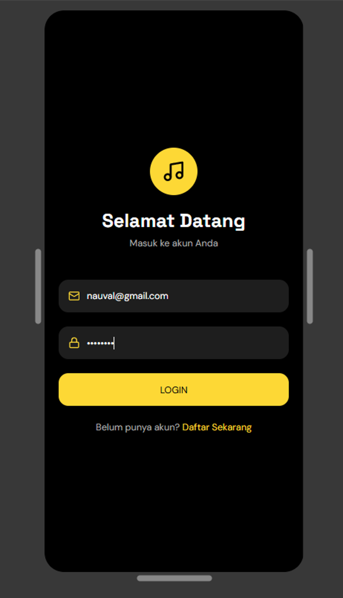
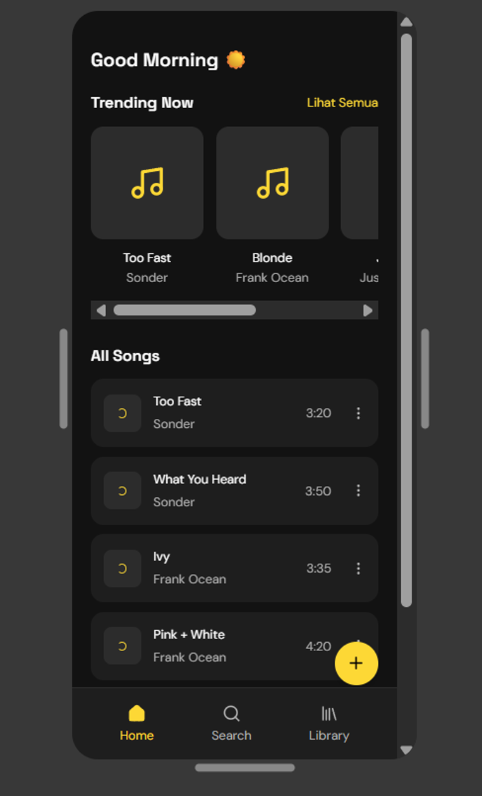
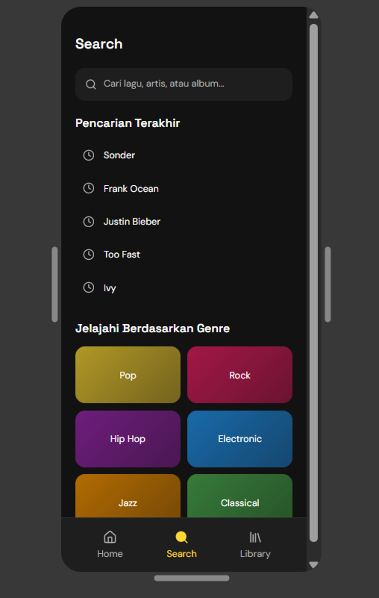
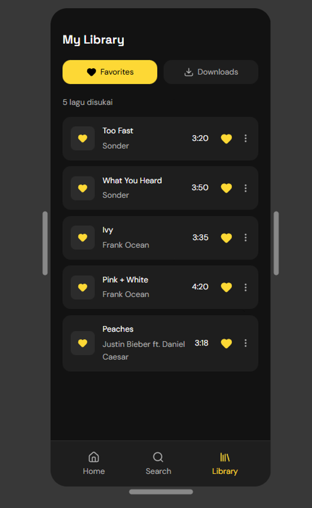
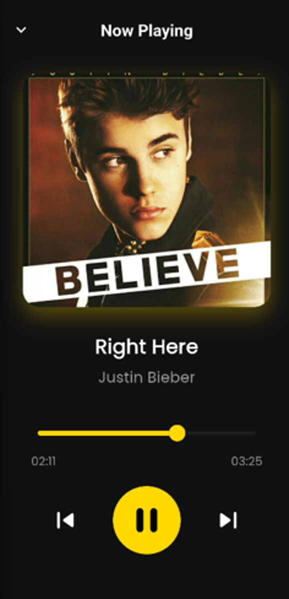
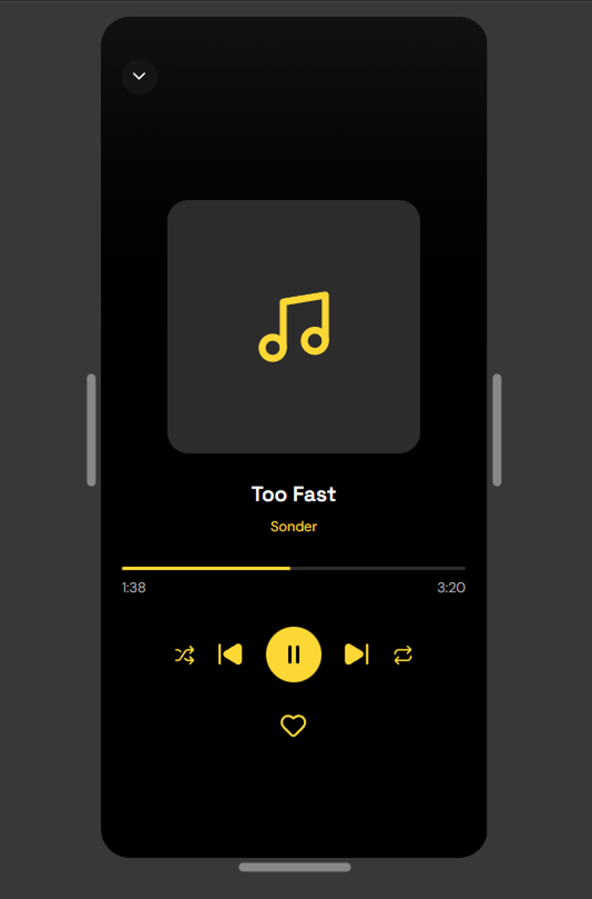

# MyTune Music App

Aplikasi music streaming modern yang memungkinkan pengguna untuk mendengarkan, mengupload, dan mengelola koleksi musik mereka dengan antarmuka yang elegan dan user-friendly.

---

## Screenshot Aplikasi

<table>
  <tr>
    <td align="center">
      
      <br/>
      <em>[Caption: Login screen dengan email/password dan Google Sign-In]</em>
    </td>
    <td align="center">
      
      <br/>
      <em>[Caption: Home screen menampilkan daftar lagu terbaru]</em>
    </td>
    <td align="center">
      
      <br/>
      <em>[Caption: Fitur pencarian lagu dengan filter]</em>
    </td>
  </tr>
  <tr>
    <td align="center">
      
      <br/>
      <em>[Caption: Library screen dengan playlist dan lagu favorit]</em>
    </td>
    <td align="center">
      
      <br/>
      <em>[Caption: Player screen dengan kontrol pemutaran musik]</em>
    </td>
    <td align="center">
      
      <br/>
      <em>[Caption: Player screen tampilan alternatif]</em>
    </td>
  </tr>
</table>

---

## Overview

**MyTune** adalah aplikasi music streaming yang dibangun dengan Flutter, memungkinkan pengguna untuk:
- Streaming musik dari cloud
- Upload lagu pribadi beserta album cover
- Membuat dan mengelola playlist
- Mencari dan menemukan lagu favorit
- Berinteraksi dengan musik melalui fitur like dan share

Aplikasi ini menggunakan Firebase sebagai backend untuk autentikasi dan database, dengan arsitektur modern menggunakan Provider untuk state management.

---

## Fitur Utama

- **Music Streaming** - Play musik dengan kontrol lengkap (play, pause, next, previous, seek)
- **Upload Lagu** - Upload file MP3 dan gambar album cover
- **Search & Discovery** - Cari lagu berdasarkan judul atau artis
- **Like Songs** - Tandai lagu favorit Anda
- **Create Playlists** - Buat dan kelola playlist custom
- **User Profile** - Manajemen profil pengguna
- **Authentication** - Login dengan Email/Password atau Google Sign-In
- **Modern Dark Theme** - UI modern dengan dark mode
- **Auto-play Next** - Otomatis memutar lagu berikutnya
- **Background Audio** - Musik tetap berjalan di background

---

## Tech Stack

### Frontend
- **Flutter 3.8.1+** - Cross-platform UI framework
- **Provider** - State management solution
- **Material Design** - UI components

### Backend & Services
- **Firebase Authentication** - User authentication & authorization
- **Cloud Firestore** - NoSQL database untuk menyimpan data lagu dan playlist
- **Firebase Storage Integration** - File management
- **External PHP Server** - Upload handler untuk MP3 dan gambar

### Key Packages
```yaml
# Audio & Media
audioplayers: ^6.0.0          # Audio playback engine
audio_session: ^0.1.18        # Background audio management
file_picker: ^8.0.0           # MP3 file picker
image_picker: ^1.0.7          # Image picker untuk album cover

# Firebase
firebase_core: ^3.6.0
firebase_auth: ^5.3.1
cloud_firestore: ^5.4.4
google_sign_in: ^6.2.2

# UI & Performance
cached_network_image: ^3.3.1  # Image caching
google_fonts: ^6.2.1          # Custom fonts
fluttertoast: ^8.2.10         # Toast notifications

# State Management
provider: ^6.1.2

# Local Storage
sqflite: ^2.3.2              # SQLite database
path: ^1.9.0
```

---

## Struktur Project

```
music_app/
├── lib/
│   ├── main.dart                    # Entry point aplikasi
│   ├── config.dart                  # Konfigurasi server (PENTING!)
│   ├── firebase_options.dart        # Firebase configuration (auto-generated)
│   ├── theme.dart                   # Global theme & color scheme
│   │
│   ├── models/                      # Data models
│   │   ├── song_model.dart          # Model untuk lagu
│   │   └── playlist_model.dart      # Model untuk playlist
│   │
│   ├── providers/                   # State management
│   │   └── audio_provider.dart      # Global audio state & control
│   │
│   ├── screens/                     # UI Screens
│   │   ├── main_screen.dart         # Bottom navigation wrapper
│   │   ├── auth/
│   │   │   ├── login_screen.dart
│   │   │   └── register_screen.dart
│   │   ├── home/
│   │   │   └── home_screen.dart     # Daftar semua lagu
│   │   ├── player/
│   │   │   └── player_screen.dart   # Music player interface
│   │   ├── upload/
│   │   │   └── upload_screen.dart   # Upload lagu baru
│   │   ├── search/
│   │   │   └── search_screen.dart   # Pencarian lagu
│   │   ├── library/
│   │   │   └── library_screen.dart  # Playlist & liked songs
│   │   └── profile/
│   │       └── profile_screen.dart  # User profile
│   │
│   ├── services/                    # Business logic & API calls
│   │   ├── auth_service.dart        # Firebase authentication
│   │   ├── firestore_service.dart   # Firestore CRUD operations
│   │   └── storage_service.dart     # File upload handler
│   │
│   └── widgets/                     # Reusable UI components
│       ├── custom_textfield.dart
│       ├── song_tile.dart
│       └── ...
│
├── android/                         # Android specific files
├── ios/                             # iOS specific files
├── web/                             # Web specific files
├── windows/                         # Windows specific files
├── linux/                           # Linux specific files
├── macos/                           # macOS specific files
│
├── screenshots/                     # UI screenshots untuk README
├── test/                            # Unit & widget tests
├── pubspec.yaml                     # Dependencies & project metadata
├── analysis_options.yaml            # Dart analyzer configuration
├── firebase.json                    # Firebase configuration
├── AGENTS.md                        # AI agent instructions
└── README.md                        # This file
```

---

## Instalasi & Setup

### Prerequisites

Pastikan Anda sudah menginstall:
- **Flutter SDK** versi 3.8.1 atau lebih baru ([Download Flutter](https://docs.flutter.dev/get-started/install))
- **Dart SDK** (included dengan Flutter)
- **Android Studio** atau **VS Code** dengan Flutter extension
- **Git** untuk version control
- **Firebase Project** (sudah dikonfigurasi)

Cek instalasi Flutter Anda:
```bash
flutter doctor
```

### Langkah-langkah Setup

#### 1. Clone Repository
```bash
git clone https://github.com/nopalqisti/music_app.git
cd music_app
```

#### 2. Install Dependencies
```bash
flutter pub get
```

#### 3. Konfigurasi Firebase

Firebase sudah dikonfigurasi untuk project ini. File-file konfigurasi yang sudah ada:
- `lib/firebase_options.dart` - Auto-generated Firebase config
- `android/app/google-services.json` - Android Firebase config
- `firebase.json` - Firebase project settings

Jika Anda ingin menggunakan Firebase project sendiri:
```bash
# Install Firebase CLI
npm install -g firebase-tools

# Login ke Firebase
firebase login

# Konfigurasi ulang Firebase untuk Flutter
flutterfire configure
```

#### 4. Konfigurasi Server Upload (⚠️ PENTING!)

Edit file `lib/config.dart` dan update IP server sesuai environment Anda:

```dart
class Config {
  static const String serverIp = "YOUR_SERVER_IP"; // Ganti dengan IP Anda
  static const String baseUrl = "http://$serverIp/mytune_server/";
  static const String uploadUrl = "${baseUrl}upload.php";
}
```

**Catatan:** 
- Untuk development lokal, gunakan IP lokal (misal: `192.168.1.205`)
- Untuk production, gunakan domain atau IP publik server Anda

#### 5. Run Aplikasi

```bash
# Android (default)
flutter run

# Platform spesifik
flutter run -d windows
flutter run -d chrome
flutter run -d macos
flutter run -d ios
flutter run -d linux
```

#### 6. Build untuk Production

```bash
# Android APK
flutter build apk --release

# Android App Bundle (untuk Google Play Store)
flutter build appbundle --release

# iOS (membutuhkan macOS & Xcode)
flutter build ios --release

# Windows
flutter build windows --release

# Web
flutter build web --release
```

---

## Cara Penggunaan

### Untuk End Users

#### 1. Login / Register
- Buka aplikasi dan pilih **Login** atau **Register**
- **Option 1:** Gunakan Email & Password
- **Option 2:** Login dengan akun Google (one-tap sign in)

#### 2. Browse & Discover Music
- Di **Home Screen**, scroll untuk melihat semua lagu yang tersedia
- Lagu ditampilkan dengan album cover, judul, dan nama artis
- Lagu terbaru muncul di bagian atas

#### 3. Search Lagu
- Tap icon **Search** di pojok kanan atas Home Screen
- Ketik judul lagu atau nama artis
- Hasil pencarian muncul secara real-time

#### 4. Play Music
- **Tap lagu** yang ingin Anda dengarkan
- Player screen akan terbuka dengan kontrol lengkap:
  - Play / Pause
  - Next Song
  - Previous Song
  - Seek bar untuk lompat ke bagian tertentu
  - Volume control
- Musik akan **otomatis melanjutkan** ke lagu berikutnya setelah selesai

#### 5. Upload Lagu Sendiri
1. Di Home Screen, tap tombol **FAB (+)** di pojok kanan bawah
2. Pilih **Album Cover** (gambar) - tap area gambar
3. Pilih **File MP3** - tap area audio file
4. Isi **Judul Lagu** dan **Nama Artis**
5. Tap tombol **"UPLOAD KE CLOUD"**
6. Tunggu proses upload selesai
7. Lagu Anda akan muncul di daftar lagu semua pengguna

#### 6. Like & Manage Library
- Tap icon hati pada lagu untuk menandai sebagai favorit
- Buka tab **Library** untuk melihat:
  - Lagu yang Anda like
  - Playlist yang Anda buat
  - Lagu yang Anda upload

#### 7. Buat Playlist
1. Buka tab **Library**
2. Tap tombol **"Create Playlist"**
3. Beri nama playlist Anda
4. Tambahkan lagu ke playlist dari menu lagu (tap icon ⋮)

#### 8. Profile Management
- Buka tab **Profile** untuk:
  - Melihat informasi akun Anda
  - Edit profile
  - Logout

---

## Dokumentasi Developer

### State Management Architecture

#### Provider Pattern
Aplikasi ini menggunakan **Provider** sebagai state management solution.

**Setup di `main.dart`:**
```dart
MultiProvider(
  providers: [
    ChangeNotifierProvider(create: (context) => AudioProvider()),
  ],
  child: MaterialApp(...),
)
```

**Mengakses Provider:**
```dart
// Listen untuk perubahan (rebuild widget)
final audioProvider = Provider.of<AudioProvider>(context);

// Tidak listen (untuk trigger action)
Provider.of<AudioProvider>(context, listen: false).playPlaylist(songs, index);

// Atau menggunakan Consumer
Consumer<AudioProvider>(
  builder: (context, audioProvider, child) {
    return Text(audioProvider.currentSong?.title ?? 'No song');
  },
)
```

#### AudioProvider - Global Audio State

`AudioProvider` mengelola seluruh state audio playback aplikasi:

```dart
class AudioProvider extends ChangeNotifier {
  // State
  bool isPlaying;              // Status play/pause
  Duration duration;           // Total durasi lagu
  Duration position;           // Posisi playback saat ini
  List<SongModel> playlist;    // Daftar lagu aktif
  int currentIndex;            // Index lagu yang sedang diputar
  SongModel? currentSong;      // Lagu yang sedang aktif

  // Methods
  playPlaylist(songs, index)   // Mulai playlist baru
  togglePlayPause()            // Play/Pause toggle
  seek(position)               // Lompat ke posisi tertentu
  playNext()                   // Lagu berikutnya
  playPrevious()               // Lagu sebelumnya
}
```

**Contoh penggunaan:**
```dart
// Play lagu dari daftar
Provider.of<AudioProvider>(context, listen: false)
    .playPlaylist(allSongs, selectedIndex);

// Toggle play/pause
audioProvider.togglePlayPause();

// Skip ke lagu berikutnya
audioProvider.playNext();
```

### Model Architecture

#### SongModel
```dart
class SongModel {
  final String id;                    // Document ID dari Firestore
  final String title;                 // Judul lagu
  final String artist;                // Nama artis
  final String albumArtPath;          // Relative path album cover
  final String songUrlPath;           // Relative path file MP3
  final String uploadedBy;            // User ID uploader
  final DateTime? uploadedAt;         // Timestamp upload
  final List<String> likedBy;         // Array user IDs yang like

  // Computed properties
  String get fullAlbumArtUrl { ... }  // Full URL album cover
  String get fullSongUrl { ... }      // Full URL MP3 file

  // Serialization
  factory SongModel.fromMap(Map<String, dynamic> map, String documentId);
  Map<String, dynamic> toMap();
}
```

**Penggunaan:**
```dart
// Parse dari Firestore
SongModel song = SongModel.fromMap(doc.data(), doc.id);

// Akses full URL (auto-generated)
Image.network(song.fullAlbumArtUrl);
AudioPlayer.play(UrlSource(song.fullSongUrl));

// Save ke Firestore
await firestore.collection('songs').add(song.toMap());
```

#### PlaylistModel
```dart
class PlaylistModel {
  final String id;
  final String name;
  final String creatorId;
  final List<String> songIds;      // Array of song document IDs
  final DateTime? createdAt;
}
```

### Firebase Architecture

#### Firestore Database Structure

**Collection: `songs`**
```javascript
{
  "title": "Song Title",
  "artist": "Artist Name",
  "album_art": "uploads/images/abc123.jpg",  // Relative path
  "song_url": "uploads/songs/xyz789.mp3",    // Relative path
  "uploaded_by": "user_uid_123",
  "uploaded_at": Timestamp,
  "liked_by": ["user_uid_1", "user_uid_2"]   // Array of user IDs
}
```

**Collection: `playlists`**
```javascript
{
  "name": "My Playlist",
  "creator_id": "user_uid_123",
  "song_ids": ["song_id_1", "song_id_2", "song_id_3"],
  "created_at": Timestamp
}
```

#### FirestoreService Methods

```dart
class FirestoreService {
  // Songs
  Future<void> addSong(SongModel song);
  Stream<List<SongModel>> getSongs();
  Future<void> deleteSong(String songId);
  Future<void> updateSong(String songId, String newTitle, String newArtist);
  Future<void> toggleLike(String songId, String userId, bool isCurrentlyLiked);

  // Playlists
  Future<void> createPlaylist(String name, String userId);
  Stream<List<PlaylistModel>> getUserPlaylists(String userId);
  Future<void> addSongToPlaylist(String playlistId, String songId);
}
```

#### AuthService Methods

```dart
class AuthService {
  User? get currentUser;
  Stream<User?> get authStateChanges;

  Future<User?> signIn({required String email, required String password});
  Future<User?> signUp({required String email, required String password});
  Future<User?> signInWithGoogle();
  Future<void> signOut();
}
```

### Audio Playback Details

**Package:** `audioplayers` v6.0.0

**Setup Listeners:**
```dart
_audioPlayer.onDurationChanged.listen((newDuration) {
  // Update total duration
});

_audioPlayer.onPositionChanged.listen((newPosition) {
  // Update current position (for seek bar)
});

_audioPlayer.onPlayerComplete.listen((event) {
  // Auto-play next song
  playNext();
});
```

**Playback Control:**
```dart
// Play dari URL
await _audioPlayer.play(UrlSource('http://example.com/song.mp3'));

// Pause
await _audioPlayer.pause();

// Resume
await _audioPlayer.resume();

// Stop
await _audioPlayer.stop();

// Seek
await _audioPlayer.seek(Duration(seconds: 30));
```

### Testing

#### Run Tests
```bash
# Semua tests
flutter test

# Test spesifik
flutter test test/widget_test.dart

# Test dengan coverage
flutter test --coverage
```

#### Analyzer & Linting
```bash
# Run Dart analyzer
flutter analyze

# Format code
flutter format lib/
```

### Build & Release

#### Android Release Build

1. **Update version di `pubspec.yaml`:**
```yaml
version: 1.0.0+1  # Format: version+buildNumber
```

2. **Generate keystore (first time only):**
```bash
keytool -genkey -v -keystore ~/upload-keystore.jks -keyalg RSA -keysize 2048 -validity 10000 -alias upload
```

3. **Configure signing di `android/key.properties`:**
```properties
storePassword=your_password
keyPassword=your_password
keyAlias=upload
storeFile=/path/to/upload-keystore.jks
```

4. **Build:**
```bash
flutter build appbundle --release  # For Play Store
flutter build apk --release        # For direct installation
```

#### iOS Release Build (macOS required)

1. **Open Xcode:**
```bash
open ios/Runner.xcworkspace
```

2. **Configure signing & capabilities di Xcode**

3. **Build:**
```bash
flutter build ios --release
```

---

## Testing & Quality Assurance

### Test Coverage

Current test file: `test/widget_test.dart`

**Perlu ditambahkan tests untuk:**
- [ ] AudioProvider state management
- [ ] Model serialization (SongModel, PlaylistModel)
- [ ] Firebase service integration
- [ ] Upload flow
- [ ] Authentication flow

### Code Quality Tools

```bash
# Analyze code quality
flutter analyze

# Check for outdated dependencies
flutter pub outdated

# Format code
flutter format .
```

---

## Known Issues & Limitations

### ⚠️ Audio Package Mismatch
- `pubspec.yaml` mencantumkan `just_audio` tapi kode menggunakan `audioplayers`
- **Impact:** Tidak ada impact fungsional, hanya dependency yang tidak terpakai
- **Fix:** Hapus `just_audio` dari `pubspec.yaml`

### ⚠️ Server IP Hardcoded
- Server IP di-hardcode di `lib/config.dart`
- **Impact:** Aplikasi tidak akan bekerja jika IP berubah atau testing dari network berbeda
- **Fix:** Implementasi environment-based configuration atau remote config

### ⚠️ Firestore Index Required
- Playlist ordering membutuhkan composite index di Firebase Console
- **Status:** Saat ini ordering di-disable untuk menghindari error
- **Fix:** Buat index di Firebase Console atau aktifkan orderBy setelah index dibuat

### Limitations

- **Network Dependent:** Aplikasi membutuhkan koneksi internet untuk streaming
- **No Offline Mode:** Lagu tidak bisa diputar offline
- **Storage:** File upload bergantung pada external PHP server
- **Platform Support:** Belum semua fitur di-test di semua platform (Android tested, others may vary)

---

## Roadmap & Future Enhancements

### In Progress
- [ ] Offline mode / Download songs
- [ ] Share songs dengan teman
- [ ] Comments & social features

### Planned Features
- [ ] **Lyrics Integration** - Tampilkan lirik lagu sinkron dengan musik
- [ ] **Audio Equalizer** - Kontrol bass, treble, dan frequency lainnya
- [ ] **Podcast Support** - Dukungan untuk streaming podcast
- [ ] **Cross-platform Sync** - Sinkronisasi playlist antar device
- [ ] **Push Notifications** - Notifikasi untuk lagu baru, playlist update, dll
- [ ] **Artist Profiles** - Halaman khusus untuk setiap artis
- [ ] **Recommended Songs (AI)** - Rekomendasi lagu berdasarkan riwayat dengar
- [ ] **Sleep Timer** - Otomatis stop musik setelah waktu tertentu
- [ ] **Chromecast Support** - Cast musik ke smart TV atau speaker
- [ ] **Collaborative Playlists** - Playlist yang bisa di-edit bersama
- [ ] **Music Analytics** - Statistik lagu yang paling sering didengar
- [ ] **Dark/Light Theme Toggle** - Pilihan tema
- [ ] **Language Localization** - Support multi-bahasa

---

## Contributing

Kontribusi sangat diterima! Jika Anda ingin berkontribusi ke project ini:

### How to Contribute

1. **Fork** repository ini
2. **Clone** fork Anda:
   ```bash
   git clone https://github.com/nopalqisti/music_app.git
   ```
3. **Create** feature branch:
   ```bash
   git checkout -b feature/AmazingFeature
   ```
4. **Commit** perubahan Anda:
   ```bash
   git commit -m 'Add some AmazingFeature'
   ```
5. **Push** ke branch:
   ```bash
   git push origin feature/AmazingFeature
   ```
6. **Open** Pull Request di GitHub

### Contribution Guidelines

- Ikuti code style yang ada (gunakan `flutter format`)
- Tulis commit messages yang jelas dan deskriptif
- Tambahkan tests untuk fitur baru jika memungkinkan
- Update dokumentasi jika mengubah API atau menambah fitur
- Pastikan `flutter analyze` tidak menunjukkan error sebelum submit PR

### Code of Conduct

- Bersikap hormat dan profesional
- Berikan feedback yang konstruktif
- Fokus pada improvement, bukan kritik personal

---

## License

Project ini dilisensikan di bawah **MIT License** - lihat file [LICENSE](LICENSE) untuk detail lengkap.

```
MIT License

Copyright (c) 2026 Muhammad Nauval Qisti

Permission is hereby granted, free of charge, to any person obtaining a copy
of this software and associated documentation files (the "Software"), to deal
in the Software without restriction, including without limitation the rights
to use, copy, modify, merge, publish, distribute, sublicense, and/or sell
copies of the Software, and to permit persons to whom the Software is
furnished to do so, subject to the following conditions:

The above copyright notice and this permission notice shall be included in all
copies or substantial portions of the Software.

THE SOFTWARE IS PROVIDED "AS IS", WITHOUT WARRANTY OF ANY KIND, EXPRESS OR
IMPLIED, INCLUDING BUT NOT LIMITED TO THE WARRANTIES OF MERCHANTABILITY,
FITNESS FOR A PARTICULAR PURPOSE AND NONINFRINGEMENT. IN NO EVENT SHALL THE
AUTHORS OR COPYRIGHT HOLDERS BE LIABLE FOR ANY CLAIM, DAMAGES OR OTHER
LIABILITY, WHETHER IN AN ACTION OF CONTRACT, TORT OR OTHERWISE, ARISING FROM,
OUT OF OR IN CONNECTION WITH THE SOFTWARE OR THE USE OR OTHER DEALINGS IN THE
SOFTWARE.
```

---

## Author

**Muhammad Nauval Qisti**

- GitHub: [@nopalqisti](https://github.com/nopalqisti)
- LinkedIn: [Nauval Qisti](https://linkedin.com/in/nauval-qisti)
- Email: muhammadnauval6777@gmail.com

---

## Acknowledgments

Terima kasih kepada:

- **Flutter Team** - Framework yang luar biasa
- **Firebase** - Backend infrastructure yang powerful
- **Google Fonts** - Koleksi font yang indah
- **Audioplayers Package Contributors** - Audio playback solution
- **Open Source Community** - Untuk semua package dan tools yang digunakan
- **Stack Overflow Community** - Untuk jawaban-jawaban yang membantu development

---

## Support

Jika Anda menemukan bug atau punya pertanyaan:

1. **Check** [Issues](https://github.com/nopalqisti/music_app/issues) yang sudah ada
2. **Create** issue baru jika belum ada yang serupa
3. **Provide** informasi lengkap:
   - Deskripsi masalah
   - Langkah-langkah untuk reproduce
   - Expected vs actual behavior
   - Screenshots jika memungkinkan
   - Platform & OS version

---

## Show Your Support

Jika project ini membantu Anda, berikan bintang di GitHub!

---

<p align="center">Made by Muhammad Nauval Qisti</p>
<p align="center">2026 MyTune Music App. All rights reserved.</p>
